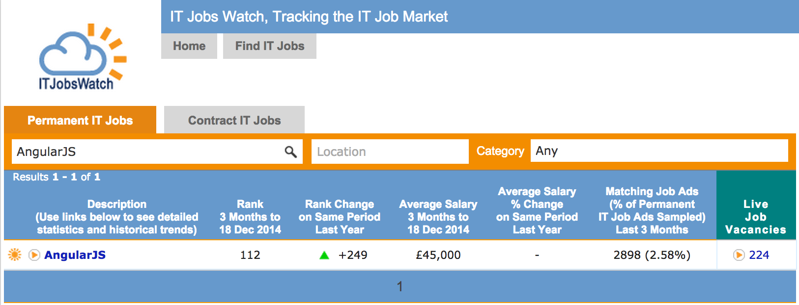
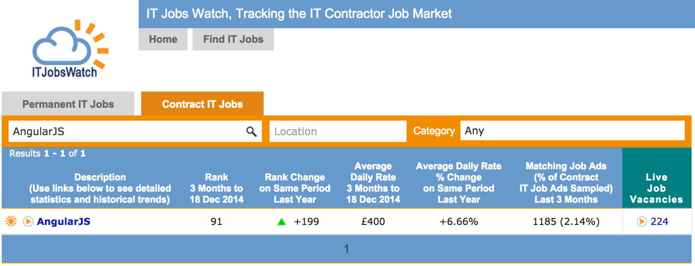
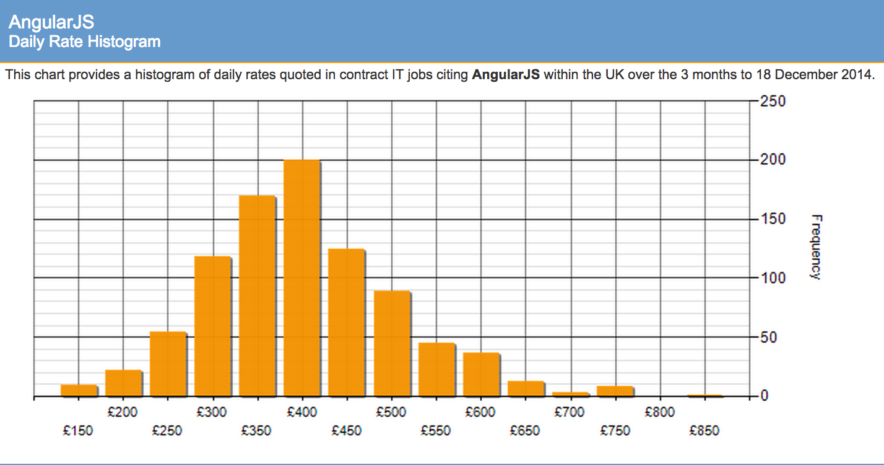
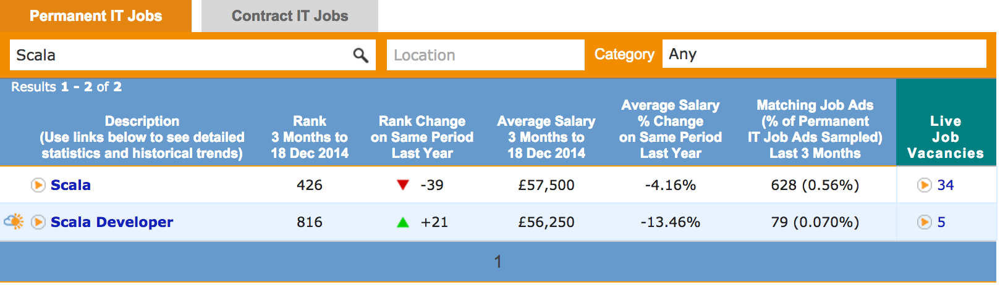
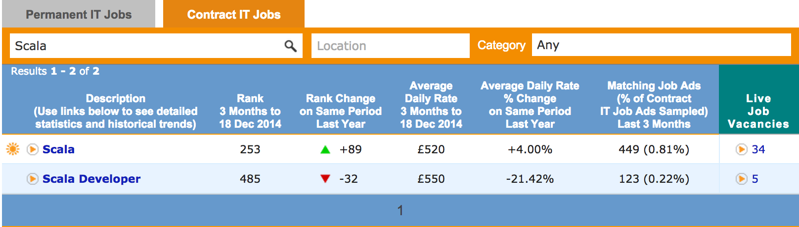
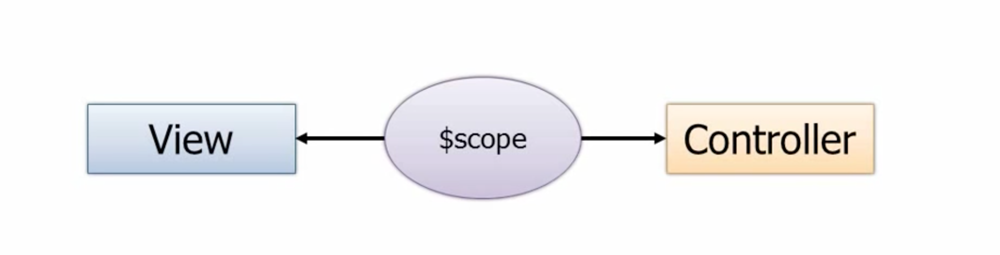

title: AngularJS Introduction
author:
  name: Rosario Rascuna
  twitter: _sarhus
  url: http://rosario.io
output: slides.html
controls: true
style: ./style.css
layout: ./layout.mustache

--

# Single Page Apps with AngularJS


--

### An Introduction

* AngularJS Features 
* Getting Started 
* Directives
* Filters 
* Views
* Controllers / Scope
* Modules
* Factories


--

#We can write rich single page apps with **AngularJS**.


--

#And also build mobile apps (+PhoneGap)

--
### AngularJS Features

What does it do?

* DOM Manipulation
* Routing
* Data Binding 
* Ajax 
* View Loading
* Caching 

--

### And also...

* MVC Architecture
* Directives
* Routing + Templates
* Testing 
* jqLite (similar to jQuery)
* History
* Model Validations
* Factories, Services, Providers...

--
### You feel like crying...

<div style="text-align:center">
    
</div>

--

### AngularJS deals with it (just one library).


<div style="text-align:center">
    
</div>

--

### Do you really need to learn all of that? 

<div style="text-align:center">
    
</div>

--

### I code for **money**

<div style="text-align:center">
    
    
</div>


--

### I code for **money**

<div style="text-align:center">
    
</div>


--

### I code for **money** (Scala)

<div style="text-align:center">
    
    
</div>


--

### Setup 

Create a _demo_ folder and a basic HTML file called _demo.html_:


    <html>
        <head>
            <script type="text/javascript" 
                    src="angular.min.js">
            </script>
        </head>
        <body>
        </body>
    </html>


Copy the _angular.min.js_ inside the folder.
<!-- <Note: test in the browser console if _angular.version.full_ returns "1.3.7"> -->

--

### Application Module

Add the _ng-app_ to the **html** tag


    <html ng-app="demo">
    ...
    </html>

The actual application code would go at the bottom:

    <script>
        var app = angular.module('demo',[]);
    </script>

> AngularJS allows to write modular applications.

--


### Directives: Teach HTML new tricks! 

What is a Directive? 

A Directive extends HTML tags, by adding

* Comments
* Attributes
* Elements

--

### Directive: ng-model 


* Add an input box with a _ng-model_ directive

    ```
    <input type="text" ng-model="name">
    ```

* We can display the _name_ on the page (**data-binding**)

    ```
    <p> Your name is {{ name }} </p>
    ```

--

### Directive: ng-init and ng-repeat

Add a _ng-init_ directive to a new **div** tag


    <div ng-init="names=['John', 'Mark', 'Jenny', 
                         'Melanie', 'Tom', 'Tamsin']">


Add a **ul** / **li** section with _ng-repeat_


    <ul>
        <li ng-repeat="n in names"> 
            {{n}} 
        </li>
    </ul>


--


### Directive: ng-class

Add the following _ng-class_ directive


    <li ng-repeat="n in names"
        ng-class="{'active': n===name}"> 
        {{n}} 
    </li>


Now we just need to add the CSS:


    <style>
        .active { background: yellow; }
    </style>


--

### Scenario: List of Customers

Johnny, your beloved project manager wants you to build a SPA 
that display a list of customers. 

He also wants you to filter by name, and order by city. 

Oh, he also wants it done by yesterday. 

--

### Ng-Repeat with an Array of Objects

We need to have a list of customers  with names and cities:

    <div ng-init="customers=[
        {name: 'Alfio', city: 'Mascali'},
        {name: 'Basilio', city: 'Belpasso'},
        {name: 'Carmelo', city: 'Catania'}]">

<nota, questo dovrebbe essere caricato usando AJAX>

We can now display the list of customers

    <li ng-repeat="customer in customers"> 
        {{customer.name}} - {{customer.city}}
    </li>


--

### Filter 

We can filter the customers using the  _name_:

    <!-- we wrote this before -->
    <input type="text" ng-model="name"/>
    <!--  ....  -->

    <li ng-repeat="customer in customers | filter: name"> 
        {{customer.name}}  - {{customer.city}}
    </li>

Note that both customer.name and customer.city is affected by the filter

--

### Order 

We can also order by city:


    <li ng-repeat="customer in customers | filter: name 
                                         | orderBy: 'city'" > 
        {{customer.name}}  - {{customer.city}}
    </li>


**Note:** We pass the property 'city' between single quotes. 
We can also apply other filters like **uppercase** (and **lowercase**):
    
    {{customer.city | uppercase}}

--

### More filters

* Currency
* Date
* JSON
* limitTo
* lowercase / uppercase
* number
* orderBy

You can also add your own filters if you'd need 

--

### Angularjs Model/View/Controller (MVC)

We'd like to keep concerns separated

* Models: Data structures (Ex. Customers)
* Views: Only templates and representation (HTML)
* Controllers: Logic and Data manipulation
* Factories (External data, AJAX, Formatting, etc.)


-- 

### More about Scope

The **$scope** is what provides data-binding between the View and the Controller
(passing data via the Scope, which at the end is just a Javascript object)

<div style="text-align:center;">

</div>

--

### Creating a Customers Controller

A controller is just a Javascript function: 

```javascript
app.controller('CustomersController',function($scope){    
     $scope.customers = [
        {name: 'Alfio', city: 'Mascali'},
        {name: 'Basilio', city: 'Belpasso'},
        {name: 'Carmelo', city: 'Catania'}];
});
```

We are going to use the _CustomersController_, instead of the _ng-init_ directive.
We can add it after the module definition


--

### Using a Controller (1/2)


Remove the ng-init from here:

    <div ng-init="customers=[
            {name: 'Alfio', city: 'Mascali'},
            {name: 'Basilio', city: 'Belpasso'},
            {name: 'Carmelo', city: 'Catania'}]">
            ...
    </div>

--

### Using a Controller (2/2)

And instead we load the controller _CustomersController_

    <div ng-controller="CustomersController">
    ...
    </div>


<!-- 


### Using Routes 

We can have severals 'pages' (dynamically loaded by AngularJS), with their
own Controllers and Views. We need to setup **routes**! 

    app.config(function($routeProvider){
        $routeProvider.when('/', {
            controller: 'CustomersController',
            view: 'views/customers.html'
        });
    });

> The index page, has a vew called **customers.html**, and it 
uses the **CustomersController**.


### Creating Views 

We create a _views_ folder and copy the HTML code from the demo page. 
Save it in a **views/customers.html** file:
    

    <p> Search for:  {{name}} </p>
    <input type="text" ng-model="name"/>
    <p> List of Names </p>
    <ul>
        <li ng-repeat="customer in customers 
                            | filter: name 
                            | orderBy:'city'"> 
            {{customer.name}}  - {{customer.city | uppercase}}
        </li>
    </ul>
    
 -->
--


### Factories

A **Factory** provides a way to retrieves data. For example


    app.factory('Customers', function(){
        var list = [
            {name: 'Alfio', city: 'Mascali'},
            {name: 'Basilio', city: 'Belpasso'},
            {name: 'Carmelo', city: 'Catania'}
        ];
        var factory = {};
        factory.getAll = function(){
            return list;
        };

        return factory;
    });

--

### Using a Factory inside a Controller

We can now use the **Customers** factory inside the CustomersController.
We can rewrite it like this:

    app.controller('CustomersController',
        function($scope, Customers){    
            $scope.customers = Customers.getAll();
        });


--

### We want to add a new Customer

Your beloved Project Manager now wants you to add a new Customer to the list.

--


### Adding a form tag inside the View

We just need to display a form inside the view 
(**note: it must be inside the ng-controller!**)

    <form>
        <label> Customer name </label>
        <input type="text" ng-model="newCustomer.name"> 
        <label> Customer city </label>
        <input type="text" ng-model="newCustomer.city"> 
        <button ng-click="addCustomer()">Add Customer </button>
    </form>

--

### How to add a Customer?

Now that we have a factory, we can add more functionalies, for example:

    app.factory('Customers', function(){
        ...
        factory.addCustomer = function (customer) {
            list.push(customer);
        };
        return factory;
    };

--

### Adding the Controller logic

We can create a function that pass data to the Factory:

    app.controller('CustomersController',
        function($scope, Customers){
            ...
            $scope.addCustomer = function() {
                Customers.addCustomer($scope.newCustomer);
            };
        });

--


### There's much more to learn

* Directives 
    ```
    <customers-list />
    <new-customer />
    ```

* AJAX Requests
* Animations
* Routing (Go to different pages/views)
